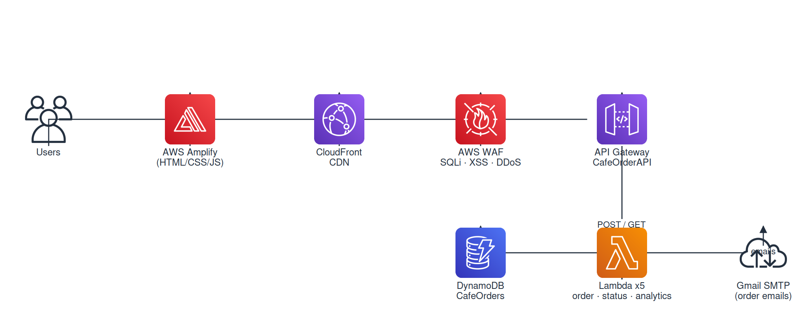

# Smart Cafe - Serverless Cloud Ordering System

A production-ready, serverless cafe ordering system built on AWS. Customers can browse the menu, place orders with optional table reservations, and receive email confirmations. Cafe owners can manage orders through an admin dashboard with real-time status updates.

> **🔒 Security:** All sensitive credentials have been removed from this repo. See [SECURITY.md](SECURITY.md) for what was sanitized and how to configure your own credentials.
>
> **📖 Backend Setup:** See [backend/README.md](backend/README.md) for step-by-step API Gateway and Lambda setup guide.

## Architecture



Traffic flows through **CloudFront** (CDN) and **AWS WAF** (web application firewall) before reaching the API Gateway. The WAF blocks SQL injection, XSS, path traversal, DDoS IPs, and other common web threats at the edge — without any additional cost under the CloudFront Free plan.

### AWS Resources

| Service | Name | Purpose |
|---------|------|---------|
| Amplify | `smart-cafe-website` | Frontend hosting with CI/CD |
| CloudFront | `E1Z02IC55JXRN7` | CDN + edge security gateway |
| WAF | `CreatedByCloudFront-f5e1fb9b` | Web application firewall (bundled with CloudFront Free plan) |
| API Gateway | `CafeOrderAPI` | REST API (POST, GET, PUT, OPTIONS) |
| Lambda | `cafe-order-processor` | Process orders, send emails |
| Lambda | `get-orders` | Retrieve all orders / single order by ID |
| Lambda | `update-order-status` | Update order status + email when ready |
| Lambda | `get-analytics` | Revenue stats and popular items |
| Lambda | `get-order-status` | Dedicated single-order lookup (optional) |
| DynamoDB | `CafeOrders` | Order storage |
| IAM Role | `cafe-order-processor-role` | Lambda permissions |

### Live URL

**Frontend:** https://dsss7mj4domm4.amplifyapp.com  
**API Endpoint:** Set via Amplify env var `API_URL` (see Getting Started)

## Project Structure

```
smart-cafe-website/
  frontend/                         # Static website files
    index.html                      Home page
    about.html                      About page
    menu.html                       Menu page
    order.html                      Order form page
    status.html                     Order tracking page
    admin.html                      Admin dashboard + analytics
    styles.css                      Global styles
    app.js                          Shared JavaScript
  backend/                          # Serverless backend
    lambda/
      cafe-order-processor/         POST / — place order + email
      get-orders/                   GET / — list/search orders
      update-order-status/          PUT / — update status + ready notification
      get-analytics/                GET /analytics — revenue + popularity
      get-order-status/             GET /order — single order lookup (optional)
    README.md                       API Gateway setup guide
  README.md                         This file
  SECURITY.md                       Sanitization & credentials guide
  troubleshooting.md                Common issues debugged
```

## Features

- **Order Online** — Select items, customize quantities, optional table reservation
- **Order Tracking** — Enter your Order ID to check status in real-time
- **Admin Dashboard** — View all orders, search/filter, update status with confirm dialog, see analytics
- **Email Notifications** — Confirmation to customer + alert to admin on new order
- **Ready Notification** — Customer gets email when order status is set to "ready"
- **Analytics** — Daily revenue, popular items breakdown on admin dashboard
- **WAF Protection** — SQLi, XSS, LFI, RFI, DDoS IPs, and known bad inputs blocked at edge
- **Expandable Order Details** — Click any order row to view full item breakdown with prices

## API Endpoints

### POST / — Place Order
```json
{ "customerName": "John Doe", "customerEmail": "john@example.com",
  "items": [{ "name": "Latte", "quantity": 2, "price": 4.50 }],
  "tableReservation": "Table 3", "specialInstructions": "Extra foam" }
```
**Response:** `{ "orderId": "ORD-...", "totalAmount": 9.00 }`

### GET / — Get Orders
- `GET /` — List all orders (newest first)
- `GET /?orderId=ORD-...` — Look up single order
- `GET /?status=pending` — Filter by status

### PUT / — Update Status
```json
{ "orderId": "ORD-...", "orderStatus": "ready" }
```
Triggers "ready for pickup" email to customer.

### GET /analytics — Stats
Returns total revenue, today's revenue, top 5 popular items, status breakdown.

## DynamoDB Schema

**Table:** `CafeOrders` | **Partition Key:** `orderId` | **Sort Key:** `customerEmail`

```json
{
  "orderId": "ORD-1783514182230-72DE4EE5",
  "customerEmail": "test@example.com",
  "customerName": "Test User",
  "items": [{ "name": "Latte", "quantity": 1, "price": 4.50 }],
  "totalAmount": 4.50, "orderStatus": "pending",
  "tableReservation": "Table 3", "specialInstructions": "",
  "createdAt": "2026-07-08T12:36:22.230111Z",
  "updatedAt": "2026-07-08T12:42:22.230111Z"
}
```

## Getting Started

### Prerequisites
- AWS account (free tier)
- GitHub account
- Gmail account with 2-Step Verification enabled

### 1. Deploy Backend
Follow the step-by-step guide in [backend/README.md](backend/README.md):
1. Create Lambda functions with the code in `backend/lambda/`
2. Set environment variables (see [SECURITY.md](SECURITY.md))
3. Create API Gateway with POST/GET/PUT methods + `/analytics`
4. Enable CORS and deploy to `prod` stage

### 2. Set Up CloudFront + WAF (Optional but Recommended)
1. Create a CloudFront distribution with API Gateway as origin
2. Use `CachingDisabled` cache policy and `AllViewerExceptHostHeader` origin request policy
3. Subscribe to the CloudFront **Free flat-rate pricing plan** ($0/month — includes WAF)
4. Attach a WAF web ACL with managed rule groups set to `Block`
5. Update `API_URL` in `frontend/*.html` to your CloudFront domain

### 3. Deploy Frontend
```bash
git clone https://github.com/wazaglo/smart-cafe-website.git
```
Push to GitHub → Amplify auto-deploys from `frontend/` directory.

**Important:** Set the `API_URL` Amplify environment variable so the placeholder `__API_URL__` gets replaced with your real endpoint at build time:
1. Go to **Amplify Console** → your app → **Environment variables**
2. Add variable: `API_URL` = `https://your-cloudfront-domain.cloudfront.net/prod`
3. Save and redeploy

### 4. Configure Credentials
See [SECURITY.md](SECURITY.md) for Gmail App Password setup and Lambda environment variables.

## Local Development

```bash
cd frontend/
open index.html        # No build tools needed
```

## Tech Stack

- **Frontend:** HTML5, CSS3, Vanilla JavaScript
- **Hosting:** AWS Amplify (auto CI/CD from GitHub)
- **CDN + Security:** Amazon CloudFront (Free plan) + AWS WAF
- **Backend:** AWS Lambda (Python 3.14, ARM64)
- **API:** Amazon API Gateway (REST, regional)
- **Database:** Amazon DynamoDB (NoSQL, on-demand)
- **Email:** Gmail SMTP via smtplib
- **IAM:** DynamoDB full access + Lambda basic execution

## Cost

**$0/month** (all within AWS Free Tier or CloudFront Free plan):
- Amplify: 1000 build min/month
- CloudFront + WAF: Free flat-rate plan ($0/month, includes 100 GB data transfer + 1M requests)
- Lambda: 1M requests/month, 400K GB-seconds
- API Gateway: 1M calls/month
- DynamoDB: 25GB storage, on-demand capacity
- Gmail SMTP: Free (500 recipients/day)
